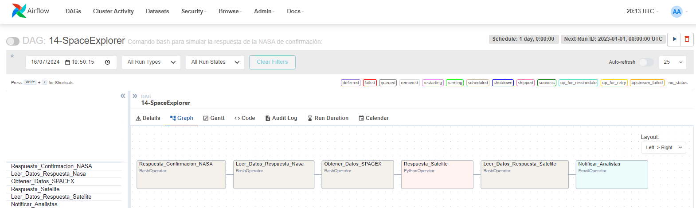

# -Airflow-Space-Project-

[Teoría y Contexto](https://www.notion.so/german-salina/Apache-Airflow-80560138773e4accb2d8bc7b5fc86468)

Proyecto: Explorar un satélite  y responder ante la información obtenida.

Los analistas necesitan la información de quienes han accedido 
al satélite e información del historial de eventos de SpaceX:

Procedimiento:

1.  Esperar a que la NASA nos dé autorización para acceder a los datos del satélite.
2.  Recolectar datos del satélite y dejarlos en un fichero.
3. Recolectar datos de la API de SpaceX y dejarlos en un fichero.
4. Enviar un mensaje a los equipos de que los datos finales están disponibles.

